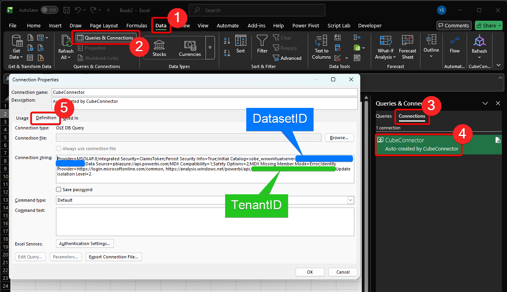

# CubeConnector

[](https://www.gnu.org/licenses/gpl-3.0)
[](https://dotnet.microsoft.com/)
[](https://excel-dna.net/)
[](https://powerbi.microsoft.com/)
[](https://github.com/[owner]/CubeConnector/releases)

An Excel-DNA add-in that creates dynamic Excel functions (UDFs) to query Power BI datasets with intelligent caching and drillthrough capabilities.

## Overview

CubeConnector bridges the gap between Excel and Power BI by allowing users to create custom Excel functions that query Power BI measures directly. Instead of manually writing complex DAX queries or relying on static pivot tables, users can define reusable functions in a JSON configuration file that automatically appear in Excel.

## Key Features

### Dynamic Function Registration
- Define custom Excel functions through JSON configuration
- Automatically register functions on workbook open
- No VBA or complex setup required

### Intelligent Caching
- Query results are cached in a hidden worksheet table
- Dramatically improves performance for repeated queries
- Manual and automatic refresh options
- Cache invalidation strategies for data accuracy

### Drillthrough Capabilities
- **Drill to Details**: Right-click any cell to see the underlying detail records
- **Drill to Pivot**: Create instant pivot tables from query results
- Context menu integration for seamless workflows

### Power BI Integration
- Direct connection to Power BI datasets via XMLA endpoint
- Support for all DAX measure types
- Automatic authentication using Azure AD

### Flexible Parameter System
- Support for multiple filter types:
  - List filters (comma-separated values)
  - Date range filters (start/end dates)
  - Single value filters
- Optional parameters with intelligent defaults
- Type-safe parameter handling (text, date, numeric)

### Excel Ribbon Integration
- Custom "CubeConnector" group in the Data tab
- Quick access to:
  - Refresh cache
  - Drill to details
  - Drill to pivot
- Visual feedback and status indicators

## Use Cases

- **Financial Reporting**: Create reusable functions for budget analysis, variance reporting, and KPI tracking
- **Sales Analytics**: Build custom functions for revenue analysis, customer segmentation, and pipeline reporting
- **Operational Dashboards**: Query real-time operational metrics directly in Excel
- **Ad-hoc Analysis**: Quickly slice and dice Power BI data without leaving Excel
- **Data Distribution**: Share Excel templates with embedded Power BI queries

## System Requirements

- Microsoft Excel (Windows)
- .NET Framework 4.7.2 or higher
- Access to Power BI Premium or Premium Per User workspace
- Azure AD authentication

## Architecture

```
┌─────────────────┐
│  Excel Workbook │
│   (User Input)  │
└────────┬────────┘
         │
         ▼
┌─────────────────┐
│  UDF Functions  │◄── JSON Configuration
│ (CubeConnector) │
└────────┬────────┘
         │
         ▼
┌─────────────────┐
│  Cache Manager  │──► Hidden Cache Sheet
│   (Optimizer)   │
└────────┬────────┘
         │
         ▼
┌─────────────────┐
│ DAX Query Build │
│    (Dynamic)    │
└────────┬────────┘
         │
         ▼
┌─────────────────┐
│  Power BI XMLA  │
│   Connection    │
└────────┬────────┘
         │
         ▼
┌─────────────────┐
│ Power BI Dataset│
│   (Measures)    │
└─────────────────┘
```

## Getting Started

### Installation

1. Download the latest release from the [Releases](../../releases) page
2. Extract the files to a local directory
3. Copy the `.xll` file to a trusted location
4. In Excel, go to File → Options → Add-ins → Manage Excel Add-ins → Browse
5. Select the `CubeConnector.xll` file
6. Click OK to enable the add-in

### Configuration

1. Create a `CubeConnectorConfig.json` file in the same directory as the `.xll` file
2. Define your functions (see [Configuration](#configuration-file-structure) section below)
3. Restart Excel or refresh the add-in

### Basic Usage

Once configured, your custom functions appear in Excel's formula autocomplete:

```excel
=CC.AmtNet(A2, B2, C2, D2, E2)
```

Where:
- `A2` = Account list (e.g., "1000,2000,3000")
- `B2` = Start date
- `C2` = End date
- `D2` = Cost center list
- `E2` = AFE number list

### Refreshing Data

**Option 1: Ribbon Button**
- Click the "Refresh" button in the CubeConnector group on the Data tab

**Option 2: Context Menu**
- Right-click any cell
- Select "CubeConnector - Refresh Cache"

**Option 3: Programmatic**
- Functions automatically refresh when cache is cleared

### Drillthrough

**Drill to Details:**
1. Click on a cell with a CubeConnector function result
2. Right-click → "CubeConnector - Drill to Details"
3. A new sheet opens with the underlying detail records

**Drill to Pivot:**
1. Click on a cell with a CubeConnector function result
2. Right-click → "CubeConnector - Drill to Pivot"
3. A new sheet opens with an interactive pivot table

## Configuration File Structure

The `CubeConnectorConfig.json` file defines your custom functions. See [CubeConnectorConfig.example.json](CubeConnector/CubeConnectorConfig.example.json) for a complete example.

### Basic Structure

```json
{
  "functions": [
    {
      "functionName": "CC.AmtNet",
      "tenantId": "your-tenant-id-here",
      "datasetPrefix": "sobe_wowvirtualserver-",
      "datasetId": "cae9a534-453a-4513-b77d-cda5bfc91fd0",
      "measureName": "[AmtNet]",
      "parameters": [ ... ]
    }
  ]
}
```

### Configuration Properties

| Property | Type | Description |
|----------|------|-------------|
| `functionName` | string | Name of the Excel function (e.g., "CC.AmtNet", "MyFunction") |
| `tenantId` | string | Azure AD tenant ID |
| `datasetPrefix` | string | (Optional) Prefix to automatically add to dataset ID if only GUID is provided (e.g., "sobe_wowvirtualserver-") |
| `datasetId` | string | Power BI dataset ID - can be full ID or just the GUID if using datasetPrefix |
| `measureName` | string | DAX measure name (e.g., "[Revenue]") |
| `parameters` | array | Array of parameter configurations |

### Parameter Configuration

| Property | Type | Description |
|----------|------|-------------|
| `name` | string | Parameter name (for documentation) |
| `position` | integer | Zero-based parameter position |
| `tableName` | string | Power BI table name for filtering |
| `fieldName` | string | Power BI field/column name |
| `dataType` | string | Data type: "text", "date", or "numeric" |
| `filterType` | string | Filter type: "List", "RangeStart", "RangeEnd", or "Single" |
| `isOptional` | boolean | Whether parameter can be empty |

### Filter Types

**List**: Comma-separated values (e.g., "1000,2000,3000")
```json
{
  "filterType": "List",
  "dataType": "text"
}
```

**RangeStart/RangeEnd**: Date or numeric range boundaries
```json
{
  "filterType": "RangeStart",
  "dataType": "date"
}
```

**Single**: Single value filter
```json
{
  "filterType": "Single",
  "dataType": "text"
}
```

## Advanced Topics

### Finding Your Power BI IDs

**Tenant ID:**
- Azure Portal → Azure Active Directory → Properties → Tenant ID

**Workspace ID:**
- Open Power BI workspace in browser
- Copy the GUID from the URL: `https://app.powerbi.com/groups/{workspace-id}/...`

**Dataset ID:**
- Open dataset settings in Power BI
- Copy the GUID from the URL: `https://app.powerbi.com/groups/.../datasets/{dataset-id}/...`
- **Note**: Some Power BI deployments use prefixed dataset IDs (e.g., `sobe_wowvirtualserver-<guid>`). You can either:
  - Provide the full dataset ID: `"datasetId": "sobe_wowvirtualserver-cae9a534-453a-4513-b77d-cda5bfc91fd0"`
  - Or use the `datasetPrefix` field and provide just the GUID:
    ```json
    "datasetPrefix": "sobe_wowvirtualserver-",
    "datasetId": "cae9a534-453a-4513-b77d-cda5bfc91fd0"
    ```
  - The prefix will be automatically added if the `datasetId` is detected as a GUID

#### Alternative Method: From Existing Excel Connection

If you already have a working Power BI connection in Excel (e.g., from a pivot table or existing query), you can extract the Tenant ID and Dataset ID directly from the connection string:

1. **Open Excel** with your Power BI connection
2. Click on the **Data** tab in the ribbon
3. Click **Queries & Connections** button
4. In the Queries & Connections pane, click the **Connections** tab
5. Right-click on your Power BI connection (e.g., "CubeConnector" or your connection name)
6. Select **Properties** to open the Connection Properties dialog
7. Click the **Definition** tab
8. Look at the **Connection string** field:
   - **Dataset ID**: Found in the `Initial Catalog=` portion (e.g., `Initial Catalog=sobe_wowvirtualserver-cae9a534-453a-4513-b77d-cda5bfc91fd0`)
   - **Tenant ID**: Found in the `Identity Isolation Level=` portion after `MDX Missing Member Mode=Error;`



This method is particularly useful when you're setting up CubeConnector to match an existing Power BI connection.

### Cache Management

The cache is stored in a hidden worksheet named `__CubeConnector_Cache__` with a table named `CubeConnector_CacheTable`. The cache structure:

| Column | Purpose |
|--------|---------|
| CacheKey | Unique hash of function + parameters |
| Value | Query result |
| Timestamp | Last refresh time |

### Performance Optimization

1. **Use caching**: Don't disable cache unless absolutely necessary
2. **Limit parameter cardinality**: Fewer unique parameter combinations = better performance
3. **Optimize DAX measures**: Ensure your Power BI measures are optimized
4. **Batch refreshes**: Refresh cache in bulk rather than individual queries
5. **Use optional parameters**: Skip unnecessary filters to reduce query complexity

### Troubleshooting

**#REFRESH Error:**
- Cache needs to be refreshed
- Click "Refresh Cache" in the ribbon or context menu

**Authentication Errors:**
- Verify tenant ID is correct
- Ensure you're signed into Excel with the correct Azure AD account
- Check Power BI workspace permissions

**Function Not Found:**
- Verify `CubeConnectorConfig.json` is in the same directory as the `.xll` file
- Check JSON syntax is valid
- Restart Excel after configuration changes

**No Data Returned:**
- Verify workspace ID and dataset ID are correct
- Check Power BI dataset is published and accessible
- Ensure measure name exactly matches (case-sensitive)

## Project Structure

```
CubeConnector/
├── CacheKey.cs                    # Cache key generation and hashing
├── CacheManager.cs                # Cache table management
├── ConfigurationStore.cs          # JSON configuration loading
├── CubeConnectorFunctions.cs      # UDF entry points
├── CubeConnectorRibbon.cs         # Excel ribbon UI
├── DAXQueryBuilder.cs             # Dynamic DAX query generation
├── DrillthroughManager.cs         # Drill-to-details functionality
├── DynamicFunctionRegistration.cs # Function registration engine
├── PivotManager.cs                # Drill-to-pivot functionality
├── QueryPoolAnalyzer.cs           # Query optimization and analysis
├── RefreshManager.cs              # Cache refresh orchestration
├── UDFConfig.cs                   # Configuration models
├── CubeConnectorConfig.json       # User configuration file
└── packages.config                # NuGet dependencies
```

## Technologies Used

- **[Excel-DNA](https://excel-dna.net/)**: High-performance Excel add-in framework for .NET
- **.NET Framework 4.7.2**: Core runtime
- **Microsoft.AnalysisServices**: XMLA/DAX connectivity
- **Excel Interop**: Excel object model integration

## License

### Open Source License

CubeConnector is licensed under the **GNU General Public License v3.0 (GPLv3)**.

This means you are free to:
- ✅ Use the software for any purpose
- ✅ Study and modify the source code
- ✅ Distribute copies of the software
- ✅ Distribute modified versions

**Under these conditions:**
- 📋 You must disclose the source code when you distribute the software
- 📋 You must license your modifications under GPLv3
- 📋 You must include the original copyright and license notices
- 📋 You must state significant changes made to the software

See the [LICENSE](LICENSE) file for the full license text.

### Enterprise Licensing

For organizations that require:
- Proprietary modifications without source code disclosure
- Commercial licensing without GPLv3 obligations
- Custom support and service level agreements
- White-label or OEM distribution rights

**Custom enterprise licenses are available.** Contact the project maintainers to discuss enterprise licensing options that fit your organization's needs.

### Third-Party Dependencies

CubeConnector depends on the following open-source libraries:

- **Excel-DNA** (v1.9.0) - Licensed under [zlib License](https://github.com/Excel-DNA/ExcelDna/blob/master/LICENSE.txt)
  - Permissive license compatible with GPLv3
  - No additional restrictions

All dependencies are compatible with the GPLv3 license.

## Contributing

Contributions are welcome! Please see [CONTRIBUTING.md](CONTRIBUTING.md) for guidelines.

## Security

For security concerns or vulnerability reports, please see [SECURITY.md](SECURITY.md).

## Roadmap

- [ ] Support for Python/R script execution
- [ ] Multi-dataset queries
- [ ] Enhanced error messaging and diagnostics
- [ ] Query performance profiling
- [ ] Export cache to CSV/JSON
- [ ] Support for Power BI paginated reports
- [ ] Parameter validation and IntelliSense
- [ ] Async query execution for large datasets

## Changelog

See [CHANGELOG.md](CHANGELOG.md) for version history and release notes.

## Acknowledgments

- Built with [Excel-DNA](https://excel-dna.net/) by Govert van Drimmelen
- Icon: [3d icons created by Freepik - Flaticon](https://www.flaticon.com/free-icons/3d)

## Support

- **Issues**: [GitHub Issues](../../issues)
- **Discussions**: [GitHub Discussions](../../discussions)
- **Documentation**: [Wiki](../../wiki)

---

**Note**: This project requires Power BI Premium or Premium Per User for XMLA endpoint access.
