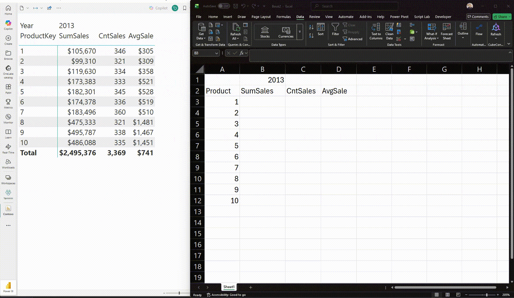
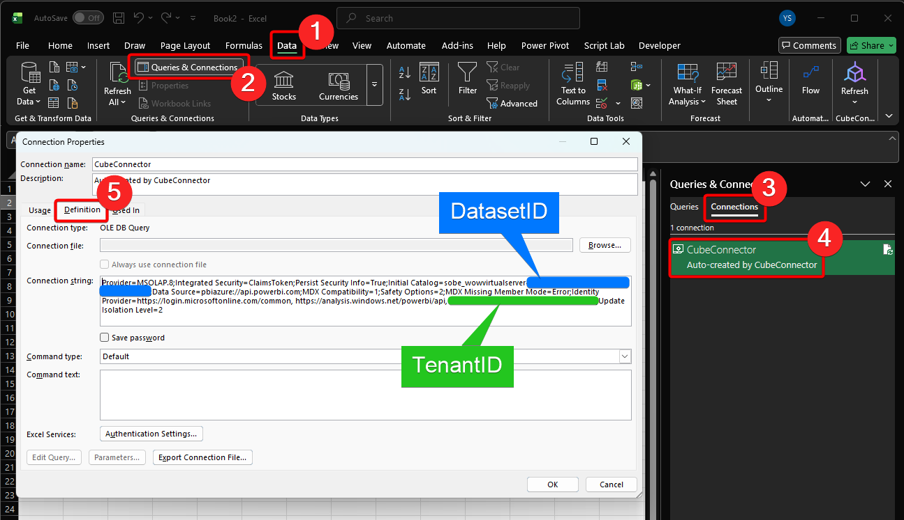

[](https://www.gnu.org/licenses/gpl-3.0)
[](https://dotnet.microsoft.com/)
[](https://excel-dna.net/)
[](https://powerbi.microsoft.com/)
[](https://github.com/[owner]/CubeConnector/releases)

A fast, flexible Excel add-in that allows you to expose your PowerBI measures as excel functions with intelligent caching and drillthrough capabilities.

## Overview

CubeConnector is a faster, easier, and more flexible alternative to Excel's built-in cube functions. You can expose any measure from your model and define up to 15 parameters for filtering. The params support single values, arrays of values, rangestart, and rangeend.


## Security and Authentication

CubeConnector leverages **Microsoft's own "Analyze in Excel" connection** infrastructure for secure auth within your own tenant. This means that CubeConnector can function without any elevated permissions, admin, or trusted apps.

## How It Works

1. **Define Functions**: You define custom Excel functions in a JSON configuration file, with each function bound to a specific measure in your Power BI model
2. **Configure Parameters**: Each function accepts up to 15 parameters, each bound to a `Table[Field]` in your model for filtering
3. **Dynamic Registration**: Functions are automatically registered with Excel when the add-in loads, appearing like any other built-in Excel function
4. **Execute Queries**: When called, CubeConnector dynamically generates and executes DAX queries against your Power BI connection
5. **Intelligent Caching**: Results are cached for performance and queries are pooled and batched where possible.

## Key Features

### Native Excel Integration
- **Works in formulas and expressions**: Use UDFs anywhere - `=MyFunc(1)+50`, `=SUM(MyFunc(1), 100)`, etc.
- **Multiple UDFs per cell**: Combine multiple functions like `=MyFunc(1)+MyFunc(2)`
- **Formula autocomplete**: Functions appear in Excel's IntelliSense like built-in functions
- **Type-safe results**: Proper numeric marshaling for calculations and aggregations

### Flexible Parameter System
- Support for multiple filter types:
  - List filters (comma-separated values)
  - RangeStart or RangeEnd (start/end dates or numeric ranges)
- Optional parameters
- Type-safe parameter handling (text, date, numeric)

### Excel Ribbon Integration
- Custom "CubeConnector" group in the Data tab
- Quick access to:
  - Refresh
  - Clear cache
  - Drill to details - creates a querytable calling the drillthough expression configured by the developer of the semantic model

## System Requirements

- Microsoft Excel (Windows)
- .NET Framework 4.7.2 or higher
- Access to Power BI Pro, Premium, or Fabric workspace

## Getting Started

### Configuration

1. Download the latest release from the [Releases](../../releases) page
2. Extract the files to a local directory
3. Configure your `CubeConnectorConfig.json` file using one of these methods:

#### Option 1: Visual Config Wizard (Recommended)

Use the [CubeConnector Config Wizard](https://ejheflin.github.io/CubeConnector/) for an intuitive visual configuration experience:

1. Open the wizard in Chrome or Edge (requires File System Access API)
2. Click "Open Config" and select your `CubeConnectorConfig.json` file
3. Enter your Tenant ID once in the sidebar
4. Add functions and configure their dataset IDs, measure names, and parameters
5. Click "Save Config" to write changes back to your json file

**Note:** The config wizard is optional - advanced users can edit the JSON directly (see Option 2).

#### Option 2: Manual JSON Edit

Edit the `CubeConnectorConfig.json` file directly in the same directory as the `.xll` file:
- Paste in your tenantID
- Paste in your datasetID
- (optional) Define each param - these are used as filters for the function
- Note: if you already have an "analyze in excel" pivot, you can find your tenantID and datasetID by inspecting the connection:


### Basic Structure

```json
{
  "functions": [
    {
      "functionName": "CC.AmtNet",
      "tenantId": "your-tenant-id-here",
      "datasetId": "your-dataset-id-here",
      "measureName": "[AmtNet]",
      "parameters": [ ... ]
    }
  ]
}
```

### Configuration Properties

| Property | Type | Description |
|----------|------|-------------|
| `functionName` | string | Name of the Excel function (e.g., "CC.SumSales", "MyFunction") |
| `tenantId` | string | Azure AD tenant ID |
| `datasetId` | string | Power BI dataset ID - can be full ID or just the GUID if using datasetPrefix |
| `measureName` | string | DAX measure name (e.g., "[Revenue]") |
| `parameters` | array | Array of parameter configurations |

### Parameter Configuration

| Property | Type | Description |
|----------|------|-------------|
| `name` | string | Parameter name (for documentation) |
| `position` | integer | Zero-based parameter position |
| `tableName` | string | Power BI table name for filtering |
| `fieldName` | string | Power BI field/column name |
| `dataType` | string | Data type: "text", "date", or "numeric" |
| `filterType` | string | Filter type: "List", "RangeStart", "RangeEnd"|
| `isOptional` | boolean | Whether parameter can be empty |

### Filter Types

**List**: Comma-separated values (e.g., "1000,2000,3000")
```json
{
  "filterType": "List",
  "dataType": "text"
}
```

**RangeStart/RangeEnd**: Date or numeric range boundaries
```json
{
  "filterType": "RangeStart",
  "dataType": "date"
}
```

5. Close out of all Excel instances and restart Excel

### Excel Installation

**Simple setup - no traditional install required:**

1. In Excel, go to File → Options → Add-ins → Manage Excel Add-ins → Browse
2. Select the `CubeConnector.xll` file from the downloaded directory
3. Click OK to enable the add-in

### Basic Usage

Once configured, your custom functions appear in Excel's formula autocomplete:

```excel
=CC.MyMeasure(p1, p2, p3, ...)
```

Where:
- `p1` = Param1 as defined in your json (e.g. Account codes "1000,2000,3000")
- `p2` = Param2 as defined in your json (e.g. Start date "1/1/2026")
- `p3` = Param3 as defined in your json (e.g. End date "12/31/2026")

**Functions work seamlessly in expressions:**
```excel
=CC.MyMeasure(p1, p2) + 50              // Arithmetic
=CC.MyMeasure(p1, p2) * 1.1             // Calculations
=SUM(CC.MyMeasure(p1, p2), 100)         // With Excel functions
=CC.MyMeasure(p1, p2) + CC.MyMeasure(p3, p4)  // Multiple UDFs
```

**Note**: Functions initially display `#REFRESH` (standalone) or `#VALUE!` (in expressions) until cached. Click Refresh to populate the cache.

### Refreshing Data

**Option 1: Ribbon Button**
- Click the "Refresh" button in the CubeConnector group on the Data tab
- If no cells need refreshing, you'll be prompted with a "Force Refresh" option to clear and rebuild the entire cache

**Option 2: Context Menu**
- Right-click any cell
- Select "CubeConnector - Refresh Cache"

**Option 3: Clear Cache**
- Use the "Clear Cache" ribbon button to delete the cache and force all formulas to refresh

**Smart Refresh Detection:**
- Automatically detects cells showing `#REFRESH`, `#VALUE!`, or other Excel errors
- Supports multiple UDFs per cell (e.g., `=MyFunc(1)+MyFunc(2)`) - each UDF is cached separately
- Skips cells with valid cached values for optimal performance

### Drillthrough

**Drill to Details:**
1. Click on a cell with a CubeConnector function result
2. Right-click → "CubeConnector - Drill to Details"
3. A new sheet opens with the underlying detail records

**Important**: Drill features only support cells with a **single** CubeConnector function. If a cell contains multiple UDFs (e.g., `=MyFunc(1)+MyFunc(2)`), you'll receive a warning and drillthrough will be cancelled. For drillthrough on combined results, create separate cells for each function first.


## Advanced Topics

### Finding Your Power BI IDs

**Tenant ID:**
- Azure Portal → Azure Active Directory → Properties → Tenant ID

**Dataset ID:**
- Open dataset settings in Power BI
- Copy the GUID from the URL: `https://app.powerbi.com/groups/.../datasets/{dataset-id}/...`
- **Note**: Some Power BI deployments use prefixed dataset IDs (e.g., `sobe_wowvirtualserver-<guid>`). You can either:
  - Provide the full dataset ID: `"datasetId": "sobe_wowvirtualserver-cae9a534-453a-4513-b77d-cda5bfc91fd0"`
  - Or use the `datasetPrefix` field and provide just the GUID:
    ```json
    "datasetPrefix": "sobe_wowvirtualserver-",
    "datasetId": "cae9a534-453a-4513-b77d-cda5bfc91fd0"
    ```
  - The prefix will be automatically added if the `datasetId` is detected as a GUID

#### Alternative Method: From Existing Excel Connection

This method is particularly useful when you're setting up CubeConnector to match an existing Power BI connection.

### Cache Management

The cache is stored in a hidden worksheet named `__CubeConnector_Cache__` with a table named `CubeConnector_CacheTable`. The cache structure:

| Column | Purpose |
|--------|---------|
| CacheKey | Unique hash of function + parameters |
| Value | Query result |
| Timestamp | Last refresh time |

### Performance Optimization

1. **Use caching**: Don't disable cache unless absolutely necessary
2. **Limit parameter cardinality**: Fewer unique parameter combinations = better performance
3. **Optimize DAX measures**: Ensure your Power BI measures are optimized
4. **Batch refreshes**: Refresh cache in bulk rather than individual queries
5. **Use optional parameters**: Skip unnecessary filters to reduce query complexity

### Troubleshooting

**#REFRESH or #VALUE! Displayed:**
- **#REFRESH**: Appears when a standalone UDF (e.g., `=MyFunc(1,2)`) needs data from cache
- **#VALUE!**: Appears when a UDF in an expression (e.g., `=MyFunc(1,2)+50`) needs data from cache
- **Solution**: Click "Refresh" in the Data tab ribbon or right-click menu to populate the cache
- **Note**: Both are normal and indicate the function is waiting for its first refresh

**Authentication Errors:**
- Verify tenant ID is correct
- Ensure you're signed into Excel with the correct Azure AD account
- Check Power BI workspace permissions

**Function Not Found:**
- Verify `CubeConnectorConfig.json` is in the same directory as the `.xll` file
- Check JSON syntax is valid
- Restart Excel after configuration changes

**No Data Returned:**
- Verify tenant ID and dataset ID are correct
- Check Power BI dataset is published and accessible
- Ensure measure name and params match the model exactly (case-sensitive)

## Technologies Used

- **[Excel-DNA](https://excel-dna.net/)**: High-performance Excel add-in framework for .NET
- **.NET Framework 4.7.2**: Core runtime
- **Microsoft.AnalysisServices**: Power BI connectivity and DAX query execution
- **Excel Interop**: Excel object model integration

## License

### Open Source License

CubeConnector is licensed under the **GNU General Public License v3.0 (GPLv3)**.

This means you are free to:
- ✅ Use the software for any purpose
- ✅ Study and modify the source code
- ✅ Distribute copies of the software
- ✅ Distribute modified versions

**Under these conditions:**
- 📋 You must disclose the source code when you distribute the software
- 📋 You must license your modifications under GPLv3
- 📋 You must include the original copyright and license notices
- 📋 You must state significant changes made to the software

See the [LICENSE](LICENSE) file for the full license text.

### Enterprise Licensing

For organizations that require:
- Proprietary modifications without source code disclosure
- Commercial licensing without GPLv3 obligations
- Custom support and service level agreements
- White-label or OEM distribution rights

**Custom enterprise licenses are available.** Contact the project maintainers to discuss enterprise licensing options that fit your organization's needs.

### Third-Party Dependencies

CubeConnector depends on the following open-source libraries:

- **Excel-DNA** (v1.9.0) - Licensed under [zlib License](https://github.com/Excel-DNA/ExcelDna/blob/master/LICENSE.txt)
  - Permissive license compatible with GPLv3
  - No additional restrictions

All dependencies are compatible with the GPLv3 license.

## Contributing

Contributions are welcome! Please see [CONTRIBUTING.md](CONTRIBUTING.md) for guidelines.

## Security

For security concerns or vulnerability reports, please see [SECURITY.md](SECURITY.md).

## Changelog

See [CHANGELOG.md](CHANGELOG.md) for version history and release notes.

## Acknowledgments

- Built with [Excel-DNA](https://excel-dna.net/) by Govert van Drimmelen
- Icon: [3d icons created by Freepik - Flaticon](https://www.flaticon.com/free-icons/3d)

## Support

- **Issues**: [GitHub Issues](../../issues)
- **Discussions**: [GitHub Discussions](../../discussions)
- **Documentation**: [Wiki](../../wiki)

---

**Compatible with Power BI Pro, Premium, and Fabric workspaces.**
